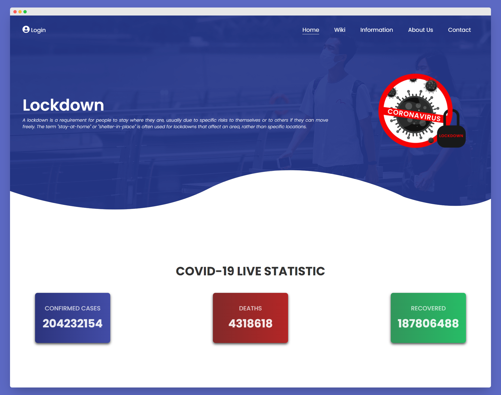

# Covid Live Tracker



Simple website using flask to track covid19.

## Environment
Python ver above 3.8.5

## Installation & Requirements
- Create virtual environment using virtualenv and copy this command
    ```bash
    pip3 install requirements.txt
    ```
- Run the app

This project will show an error because the API i'm using has been removed.